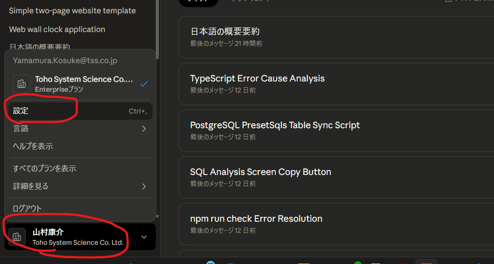
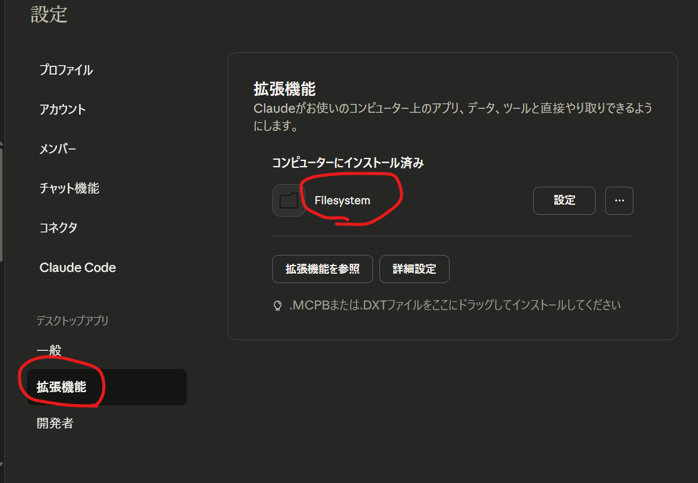
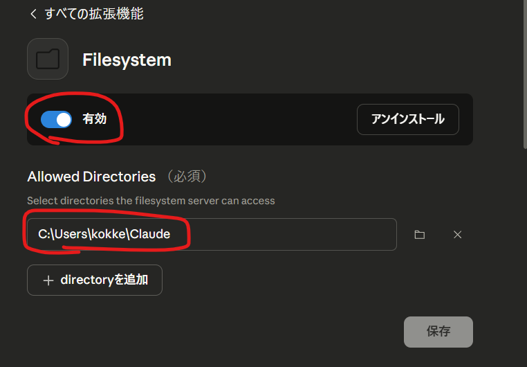

## **クロード（Claude）Desktop入門・実践ハンズオン**

**～AIとの対話でWebアプリを創り出そう～**

この資料は、私たちの業務で強力な武器となる「Claude Desktop」の基本的な使い方をマスターし、簡単なWebアプリケーションをAIと一緒に作り上げるための入門ガイドです。

AIへの指示は、細かく命令するだけでなく、**大まかな要望を伝えてAIに任せる**ことも可能です。今回はその後者の方法で、AIの能力を最大限に引き出す開発スタイルを体験してみましょう。

### **1. Claude Desktopとは？**

* **Claude（クロード）**: Anthropic社が開発した最先端のAI。自然な日本語での対話、文章要約、プログラムコード生成などが得意です。
* **Claude Desktop**: Web版ClaudeをPCでより安全かつ高機能に利用するための公式アプリ。PC内のファイルを直接AIに操作させられる**「Filesystem拡張機能」**が最大の特長です。


### **2. 導入と初期設定**

1. 社内ポータル等で案内された公式ページから「Claude Desktop」をダウンロードし、PCにインストールします。
2. 初回起動時に、会社から支給されたアカウントでサインインしてください。

### **3. Filesystem拡張機能の設定**

AIにPC内のファイルを操作させるための、最初の重要な設定です。

1. Claude Desktop画面左のメニューから「拡張機能」タブをクリックします。
2. 一覧から「Filesystem」を探し、「詳細設定」ボタンをクリックします。
3. 「許可するディレクトリ」のセクションで、この後の作業で使うプロジェクト用のフォルダを追加します。まず、エクスプローラーで `ドキュメント` フォルダなどに `webapp-sample` という名前のフォルダを新規作成してください。
4. その後、その `webapp-sample` フォルダのフルパス（例: `C:\Users\あなたのユーザー名\Documents\webapp-sample`）を許可ディレクトリとして設定します。
5. 最後に、Filesystemの設定を確認し、「有効」となっていることを確認してください。
6. 

> **【重要ポイント】**
> この設定はすべてGUI（画面上の操作）だけで完結します。設定ファイルを手動で編集する必要はありません。

### **4. 【実践】AIにWebアプリの雛形を作ってもらおう**

それでは、AIに大まかな要望だけを伝えて、Webアプリを作ってもらいましょう。

**4-1. AIへの指示（プロンプト）**

Claude Desktopのチャット画面で、以下のシンプルな指示を送信します。ファイル名やデザインの詳細はAIに任せます。

```text
許可している `webapp-sample` フォルダに、簡単なWebサイトの雛形を作成してください。
構成はトップページとWEB時計ページの2ページ構成でお願いします。
それぞれのページには簡単なスタイリングを当てて、相互にリンクできるようにしてください。
トップページにはボタンを一つ配置し、クリックすると時間に合わせてJavaScriptで何か面白いメッセージが出るようにしてください。
```

**4-2. AIの提案を確認・承認する**

この指示を送信すると、AIはファイル名、コード、デザインなどを自ら考えて、複数のファイル作成プランを提示してきます。

「以下のファイル操作を承認しますか？」という確認画面が表示されたら、AIがどのようなファイル（例: `index.html`, `clock.html`, `style.css`など）を作ろうとしているかを確認し、「承認」ボタンをクリックします。
※毎回確認するのが面倒な場合は「常に許可」を選択することも可能です。

**4-3. 動作を確認する**

1. VSCodeを起動し、「フォルダーを開く」から `webapp-sample` フォルダを開きます。
2. AIが生成したファイル一式が格納されていることを確認します。
3. `index.html` などをブラウザで開き、以下の点を確認してみましょう。
    * ページのデザインはどうか？（AIのセンスを見てみましょう）
    * ページ間のリンクは正しく機能するか？
    * ボタンをクリックすると、AIが考えたメッセージが表示されるか？
4. 必要なら自分自身で修正、またはClaudeに指示出しして修正＆ブラッシュアップをしていきます。

***
### **5. 【応用】後日、作成したアプリを修正・機能追加する**

一度チャットを閉じてしまうと、AIはその会話の文脈を忘れてしまいます。しかし、**Filesystem機能を使えば、AIに既存のファイルを読み込ませ、文脈を理解させた上で修正を依頼する**ことが可能です。

**5-1. AIに現状を読み込ませる**

新しいチャットを開始したら、まず以下の指示を送り、AIにプロジェクトの現状を把握させます。これが最も重要なステップです。

```text
`webapp-sample` フォルダにあるWebサイトのプロジェクトを読み込んで、現在の内容を把握してください。
その上で、これからいくつかの修正をお願いします。
```

**5-2. 修正・機能追加を指示する**

AIがファイルを読み込み、内容を理解したら、具体的な修正を依頼します。

**【修正例①：デザインの変更】**

```text
サイト全体のテーマカラーを「秋」をイメージした色合い（オレンジやブラウン系）に変更してください。
```

**【修正例②：HTML要素の追加】**

```text
全てのページに共通のフッターを追加してください。フッターには「© 2025 TSS, Inc.」と表示してください。
```

**【修正例③：JavaScript機能の拡張】**

```text
WEB時計ページの機能を拡張して、現在時刻だけでなく、今日の日付（年/月/日 曜日）も表示するようにしてください。
```

このように、一度作ったプロジェクトもAIとの対話を通じて継続的に改善していくことができます。

***

### **6. AIへの指示のコツ：『抽象的な指示』と『詳細な指示』**

今回は「抽象的な指示」でAIに多くを委ねましたが、開発の場面に応じて指示の粒度を変えることが重要です。


| アプローチ | **抽象的な指示（今回試した方法）** | **詳細な指示** |
| :-- | :-- | :-- |
| **目的** | AIの能力を活かして**素早くラフ案**を作らせる | 意図通りに**正確なもの**を作らせる |
| **メリット** | ・指示が短く、スピーディ<br>・AIから思わぬ提案が期待できる | ・期待通りのものが一発で完成しやすい<br>・再現性が高い |
| **デメリット** | ・期待と違うものができる可能性がある<br>・手直しが必要になる場合がある | ・プロンプト作成に手間がかかる<br>・AIの創造性を活かしにくい |
| **向いている場面** | ・プロトタイピング、アイデア出し<br>・デザインや機能のたたき台作成 | ・仕様が厳密に決まっている開発<br>・既存コードの正確な修正 |

もし、仕様通りに正確なものを作りたい場合は、ファイル名やコードの要件を細かく指定する「詳細な指示」が有効です。（参考として、そのような指示の例は私に聞いてもらえれば提示します）

**状況に応じてこの2つのアプローチを使い分ける**ことが、AIを使いこなす鍵となります。

### **7. まとめ**

* Claude Desktopは、**AIとの対話を通じて、自分のPC上で直接開発を進められる**強力なツールです。
* AIへの指示は、**目的や状況に応じて「抽象的」にも「詳細」にも**使い分けることが生産性向上の鍵です。
* VSCodeと組み合わせることで、**AIによる自動生成と人間による確認・修正をスムーズに行う**開発サイクルを確立できます。

AIが生成したコードは、必ず一度は自分で目を通し、その内容を理解するよう努めてください。これがスキルアップへの一番の近道です。ご不明な点があれば、いつでも質問してください。

